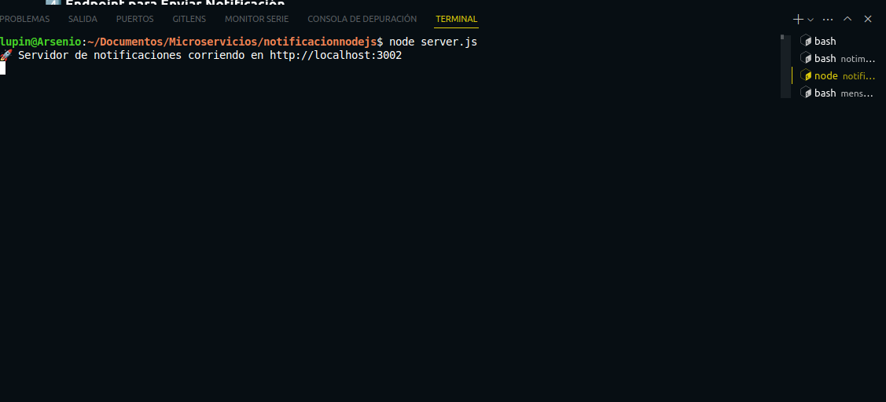

# Microservicio de Notificaciones

Este microservicio maneja las notificaciones de conexión de usuarios en tiempo real. Proporciona un endpoint que devuelve un sonido de notificación cuando un usuario se conecta.

---

## 📌 Estructura del Código

### 1️⃣ Importación de Módulos
```javascript
const express = require("express");
const cors = require("cors");
```
Se importan las librerías necesarias:
- **express**: Para gestionar las rutas y el servidor HTTP.
- **cors**: Para permitir solicitudes desde cualquier origen.

### 2️⃣ Configuración del Servidor
```javascript
const app = express();
const PORT = 3002;

app.use(cors());
app.use(express.json());
```
Se inicializa el servidor Express, habilitando **CORS** para permitir solicitudes de diferentes dominios y el soporte para JSON en las peticiones.

### 3️⃣Definición del Sonido de Notificación
```javascript
const sonidoNotificacion = "https://cdn.pixabay.com/audio/2024/05/19/audio_48ac856676.mp3";
```
Se define la URL del sonido que se enviará como respuesta cuando un usuario se conecte.

### 4️⃣ Endpoint para Enviar Notificación
```javascript
app.post("/api/notificar-conexion", (req, res) => {
    res.json({ success: true, sonido: sonidoNotificacion });
});
```
Cada vez que un usuario se conecta, este endpoint devuelve el enlace del sonido de notificación.

### 5️⃣ Inicio del Servidor
```javascript
app.listen(PORT, () => {
    console.log(`🚀 Servidor de notificaciones corriendo en http://localhost:${PORT}`);
});
```
El servidor se ejecuta en el puerto **3002** y queda a la espera de solicitudes.

---

### 6️⃣ Imagen de Despliegue
Salida exitosa atravez de la terminal

 