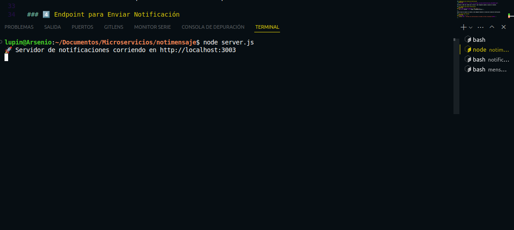

# Microservicio de Notificaciones de Mensajes

Este microservicio se encarga de gestionar las notificaciones cuando se envía un mensaje en el sistema de comunicación. Utiliza **Express.js** para manejar solicitudes HTTP y **CORS** para permitir accesos desde distintos orígenes.

---

## 📌 Estructura del Código

### 1️⃣ Importación de Módulos
```javascript
const express = require("express");
const cors = require("cors");
```
Se importan las librerías necesarias:
- **express**: Para crear el servidor HTTP.
- **cors**: Para permitir solicitudes desde distintos orígenes.

### 2️⃣ Configuración del Servidor
```javascript
const app = express();
const PORT = 3003;

app.use(cors());
app.use(express.json());
```
Se inicializa **Express** y se configuran las opciones de **CORS** y soporte para JSON en las solicitudes.

### 3️⃣ Definición del Sonido de Notificación
```javascript
const sonidoNotificacion = "https://cdn.pixabay.com/audio/2022/12/12/audio_e6f0105ae1.mp3";
```
Se define una URL de audio que se enviará como notificación cuando se reciba un mensaje.

### 4️⃣ Endpoint para Notificar un Mensaje
```javascript
app.post("/api/notificar-mensaje", (req, res) => {
    res.json({ success: true, sonido: sonidoNotificacion });
});
```
Este endpoint responde con la URL del sonido de notificación cuando se recibe una solicitud de notificación de mensaje.

### 5️⃣ Inicio del Servidor
```javascript
app.listen(PORT, () => {
    console.log(`🚀 Servidor de notificaciones corriendo en http://localhost:${PORT}`);
});
```
Se inicia el servidor en el puerto **3003**.

---


### 6️⃣ Imagen de Despliegue
Salida exitosa atravez de la terminal

 
---

